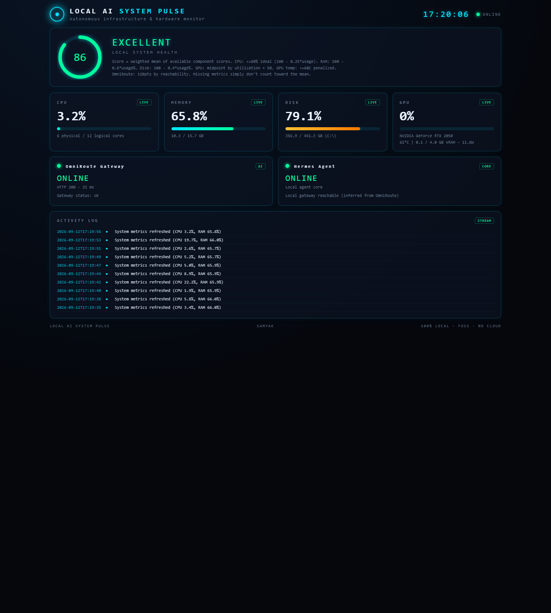

<p align="center">
  
</p>

<h1 align="center">LOCAL AI SYSTEM PULSE</h1>

<p align="center"><em>Your laptop. Your AI stack. One live pulse.</em></p>

<p align="center">
  A 100% local, real-time health & monitoring HUD for your system resources and your local AI infrastructure — live CPU, RAM, disk & NVIDIA GPU telemetry, your OmniRoute gateway's status, an activity event stream, and a transparent health score.
</p>

<p align="center">
  <a href="https://samyakkothare.github.io/local-ai-system-pulse/"><strong>▶ Live Demo (static)</strong></a> ·
  <a href="#installation"><strong>Run locally</strong></a>
</p>

<p align="center">
  
  
  
  
  
  
  
</p>

> **A real, working monitoring dashboard** — not a mock-up. The screenshot above is
> rendered live from the backend on a Windows 11 machine.

---

## 📺 What it does

A small self-contained, JARVIS-style "system pulse" for your machine. It shows at a glance:

| | |
|---|---|
| 🖥️ **CPU, RAM, Disk** | live usage across all cores, real-time memory & the most-utilized volume |
| 🎮 **NVIDIA GPU** | utilization, VRAM used/total, temperature, power draw (via `nvidia-smi`) |
| 🧠 **OmniRoute gateway** | reachability, HTTP status, response latency, safe status/timestamp |
| 🤖 **Hermes indicator** | conservative local agent-gateway liveness (never modifies Hermes) |
| 📜 **Live event stream** | app started, metrics refreshed, service down / recovered |
| 💚 **Health score** | transparent 0–100 overall score with fully documented criteria |

---

## ✨ Feature showcase

### 🖥️ System telemetry
Live CPU %, logical/physical core counts, RAM used/total/available, and disk usage of your most-utilized local volume — refreshed continuously in the background.

### 🎮 GPU intelligence
When an NVIDIA GPU + `nvidia-smi` are present, the dashboard adds utilization, VRAM, temperature and power. If absent it shows **"unavailable"** — it never fabricates a number.

### 🧠 AI infrastructure
Probes your local **OmniRoute** gateway at `127.0.0.1:20128` and surfaces reachability, HTTP status, and latency alongside a conservative Hermes liveness indicator.

### 📡 Live monitoring
A threaded poller keeps cached metrics fresh (system every ~2 s) while an in-memory event ring buffer logs lifecycle changes — service down, service recovered, metric refresh.

### 💚 Health intelligence
An explicit, deterministic 0–100 score from the available metrics, with the exact formula shown in the UI. Missing metrics simply don't count toward the mean.

### 🔒 Privacy
Binds to `127.0.0.1` only. No cloud, no telemetry, no API keys required by the dashboard, no public exposure. Your data never leaves the machine.

---

## 💡 Why this project?

Most "system monitors" are heavyweight, cloud-bound, or shove raw OS access into the browser. This one takes the opposite stance:

- **100% local, no cloud** — nothing is uploaded, ever.
- **No paid APIs, no keys** — the dashboard needs no credentials to run.
- **Minimal dependencies** — just `psutil`; the rest is the Python standard library.
- **The backend owns OS access** — the browser only ever talks to a small local JSON API. It never touches the operating system directly.
- **Graceful degradation over fake values** — if a sensor is missing (no NVIDIA GPU, OmniRoute down), the panel shows *unavailable / offline* honestly, instead of inventing a reading.

That last point is the whole design philosophy: **an honest, minimal, local tool that degrades gracefully.**

---

## 🏗️ Architecture

```
        ┌──────────────────────────────────────────────┐
        │  Browser  (frontend/ static HTML/CSS/JS)      │
        │  polls the JSON API every ~2s, renders the HUD │
        └───────────────────────┬──────────────────────┘
                                │  HTTP over 127.0.0.1:8712
                                ▼
        ┌──────────────────────────────────────────────┐
        │  Python backend  (backend/server.py)          │
        │  stdlib http.server + ThreadingHTTPServer     │
        │  exposes JSON API ONLY; all OS access here    │
        └───┬──────────────┬──────────────┬────────────┘
            │              │              │
     ┌──────▼─────┐  ┌─────▼─────┐  ┌─────▼───────────────────┐
     │ psutil     │  │ nvidia-smi│  │ OmniRoute gateway probe │
     │ CPU/RAM/Disk│  │ GPU       │  │ http://127.0.0.1:20128  │
     └────────────┘  └───────────┘  └─────────────────────────┘
```

- **Backend** (`backend/server.py`): a Python **standard-library** HTTP server that does all OS/GPU/gateway access server-side and presents a small JSON API.
- **Frontend** (`frontend/`): static HTML/CSS/JS served by the same backend. Pure browser JS — no build step, no framework, no dependencies.
- **Pollers**: a background thread refreshes cached system metrics every ~2 s; endpoints read the cache for fast, consistent responses.
- **Bind**: `127.0.0.1` only — never exposed to the public internet.

**The browser never accesses the operating system.** All telemetry is gathered by the backend and delivered over the local API.

---

## 🧰 Tech stack

| Layer | Technology |
|---|---|
| Backend | **Python** (stdlib `http.server` + `ThreadingHTTPServer`) |
| System metrics | **psutil** |
| GPU metrics | **nvidia-smi** (subprocess, optional) |
| Gateway probe | **urllib** → OmniRoute `http://127.0.0.1:20128` |
| Frontend | **HTML · CSS · JavaScript** (no framework, no build step) |
| Integration | **OmniRoute** local AI gateway |

That's the complete stack — deliberately small.

---

## ⚙️ Installation

### Windows
```bash
cd "D:/HERMES files/Projects/LocalAISystemPulse"
python -m venv .venv
.venv\Scripts\activate
pip install -r requirements.txt
```
*(If `psutil` is already installed globally, the venv is optional.)*

### Linux / macOS
The backend is deliberately platform-light and should run on POSIX systems with minor tweaks (e.g. `source .venv/bin/activate`). GPU metrics require an NVIDIA GPU + `nvidia-smi`.

### Run
```bash
python backend/server.py
```
Then open your browser to:

```
http://127.0.0.1:8712
```

You'll see the HUD immediately; metrics refresh every ~2 seconds.

---

## 📊 What you get

Once running, the dashboard monitors:

```text
CPU      ████████░░  42%   (12 logical / 6 physical cores)
RAM      ██████████░░░░░  61%   (9.5 / 15.7 GB)
Disk     ███████████████░░  79%   (C:\ NTFS)
GPU      NVIDIA GeForce RTX 2050 · 0% util · 58°C · 11.6 W · 149/4096 MB VRAM
OmniRoute  ONLINE · HTTP 200 · 31 ms
Health   ████████████████░  86  EXCELLENT
```

*Real values shown here were captured from the running dashboard; your numbers will differ by machine and load.*

---

## 🔌 API

All endpoints return JSON. The browser hits these over `127.0.0.1:8712`.

| Endpoint | Description |
|---|---|
| `GET /` | The dashboard UI (`index.html`) |
| `GET /api/system` | CPU, memory, disk, GPU, platform, hostname |
| `GET /api/omniroute` | OmniRoute reachability, HTTP status, latency, safe info |
| `GET /api/hermes` | Hermes liveness indicator (conservative heuristic) |
| `GET /api/events` | Recent activity events |
| `GET /api/health-score` | Overall 0–100 score + component breakdown + criteria |
| `GET /api/summary` | Combined system + omniroute + hermes + score + events in one call |

---

## 💚 Health score

The score is the **mean of the component scores that are actually available** — missing metrics simply don't count toward the mean.

| Component | Rule |
|---|---|
| **CPU** | ≤80% → `100 − 0.25·usage` (0% = 100, 80% = 80); >80% → `max(0, 80 − (usage−80)·2)` |
| **RAM** | `max(0, 100 − usage%·0.8)` |
| **Disk** | `max(0, 100 − usage%·0.4)` |
| **GPU util** | `50 + 0.5·(100 − utilization)` |
| **GPU temp** | `max(0, 100 − max(0, temp−60)·2)` |
| **OmniRoute** | ±20 pts via reachability (100 when reachable, 0 when not) |

**Verdict:** ≥85 = *EXCELLENT*, ≥70 = *GOOD*, ≥50 = *FAIR*, else *POOR*. The exact formula string is also shown in the dashboard UI (`criteria`).

---

## 🧠 OmniRoute integration

The backend probes `http://127.0.0.1:20128/api/health` with a short timeout and reports:

- **Reachable** → ONLINE, HTTP status, latency (ms), and any safe `status` / `timestamp` fields.
- **Unreachable** → OFFLINE, clearly labeled — and the dashboard keeps working.

**No secret or API-key material is ever exposed.** Only summary fields (`status`, `timestamp`) are parsed and shown.

The **Hermes panel** is a conservative inference: when OmniRoute is reachable, Hermes (which runs locally alongside it) is labeled *online*; otherwise *unknown* — never a false "online."

---

## 🔒 Privacy & security

- **Loopback only** — the server binds to `127.0.0.1:8712`; it is never exposed to the public internet.
- **No cloud telemetry** — nothing leaves the machine. Ever.
- **No API keys required** — the dashboard runs with zero credentials.
- **Safe OmniRoute fields** — only `status` / `timestamp` summary fields are read.
- **No authentication** — unnecessary because it's loopback-only (single-user local tool).

---

## 🌐 GitHub Pages

> **GitHub Pages hosts a static showcase only.** It cannot run the Python backend that reads real system/GPU metrics and probes the local OmniRoute gateway.

- **Live demo URL:** https://samyakkothare.github.io/local-ai-system-pulse/
- The Pages demo ships the same frontend styling with **placeholder** values and an explicit banner — it does **not** fake live system data.
- **The real, functional dashboard runs locally:**
  ```bash
  python backend/server.py   # then open http://127.0.0.1:8712
  ```

GitHub Pages = **UI showcase**. Local Python backend = **actual live monitoring**.

---

## ⚠️ Known limitations

- **GPU metrics** require an NVIDIA GPU + `nvidia-smi` in PATH; AMD/Intel iGPUs are not detected (shown as N/A, never faked).
- **No per-interface raw network bandwidth metering** (cross-platform inconsistency); network state is reflected through the OmniRoute reachability probe.
- **Hermes status** is an *inference* (OmniRoute reachable ⇒ Hermes likely live), not a direct IPC check — read-only, no Hermes modification.
- **In-memory event log** — events are lost on restart (by design; ring buffer capped at 200).
- **Single-user local tool** — no authentication (acceptable because it is loopback-only).
- **OmniRoute info** is intentionally limited to safe summary fields to avoid exposing secrets.

---

## 🗺️ Roadmap

- [ ] Persist event history to a small **SQLite** file so the log survives restarts
- [ ] Add historical **sparkline charts** for CPU / RAM / GPU over time (local, Canvas)
- [ ] Add **per-interface bandwidth** metering where the OS exposes it cleanly
- [ ] Optional **local LLM** (Ollama) integration to summarize health anomalies — kept local, no cloud
- [ ] **WebSocket** push instead of 2 s polling (lower overhead, smoother updates)

*All roadmap items are planned; none are yet implemented.*

---

## 🤝 Project status & experimenting

Local AI System Pulse is a small personal / open-source experiment. It is intentionally minimal and dependency-light so it's easy to read, fork, and run.

To try it: install `psutil`, run `python backend/server.py`, and open `http://127.0.0.1:8712`. Submit a pull request or open an issue on GitHub if you build on it.

---

## 📄 License

**MIT** — free to use, modify, and redistribute. No cloud, no tracking, no telemetry.

---

<p align="center">
  Built locally · Runs locally · Your telemetry stays local.
</p>